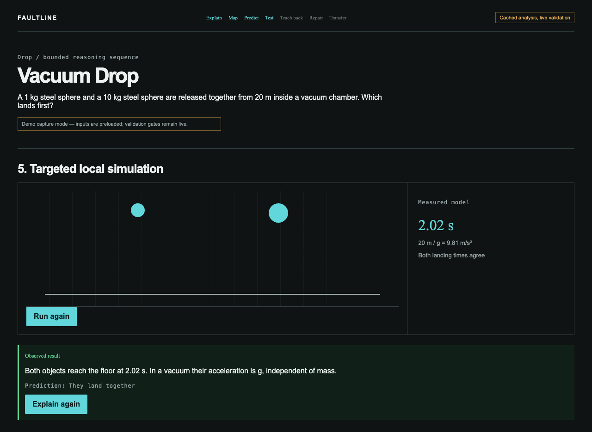
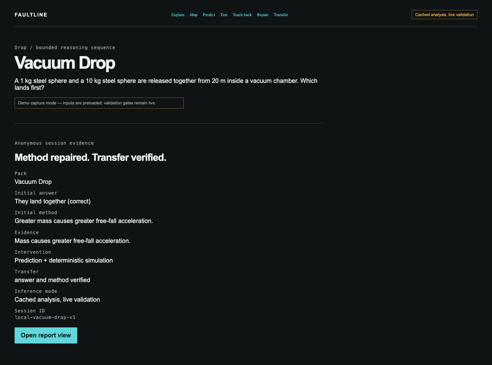

# Faultline

Faultline helps learners inspect, test, and repair the reasoning behind physics answers.

## Important links

- Live demo — public deployment pending
- Demo video — final public URL pending
- [Evaluation page](https://github.com/nirvairsndhu/faultline-learning/blob/main/docs/EVALUATION.md)
- [Source repository](https://github.com/nirvairsndhu/faultline-learning)

## What it does

A learner chooses an answer and explains the reasoning behind it. Faultline maps the claimed relationship, asks the learner to predict an outcome, runs a targeted simulation to test that relationship, and guides a revision. A transfer question then checks whether the repaired reasoning holds in a changed context.

## Why it matters

A correct answer can still hide incorrect reasoning. Faultline separates the answer from the method and makes the repair process visible.

## Scenarios

- **Vacuum Drop** — Compare how objects fall when air resistance is removed.
- **Collision Forces** — Reason about how interacting objects exert forces on each other.
- **Projectile Motion** — Separate horizontal and vertical motion in a launch.

## How it works

```text
Answer → Explain → Map → Predict → Simulate → Repair → Transfer → Report
```

Language extraction interprets the learner’s explanation. Deterministic code owns physics validation, simulations, evidence checks, repair, and transfer.

## Screenshots






## Run locally

```bash
npm install
npm run dev
```

Open [http://localhost:3000](http://localhost:3000).
