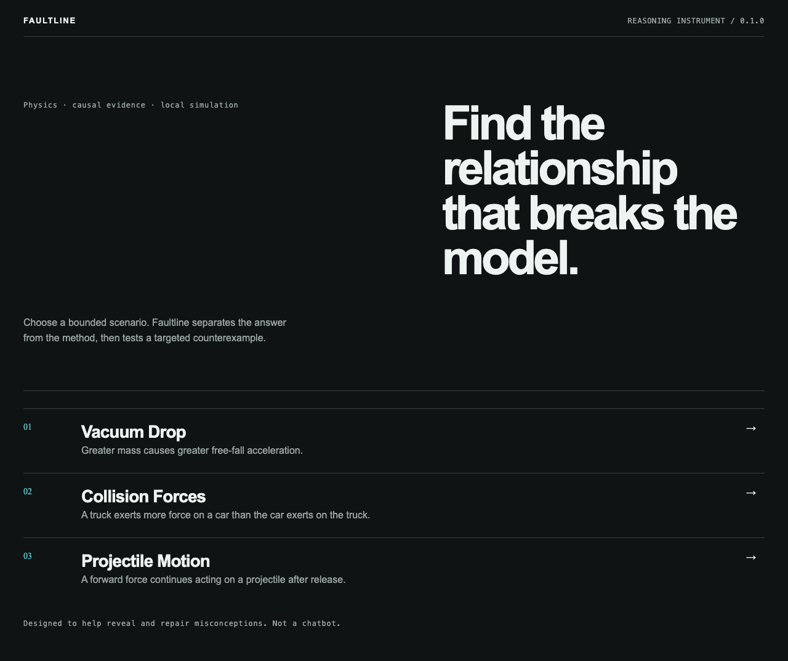
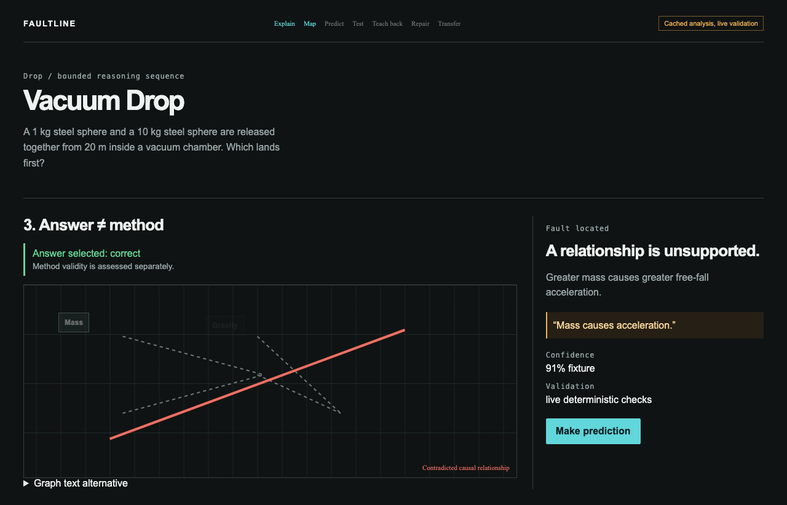
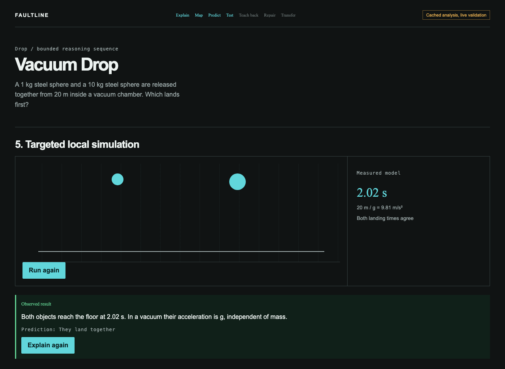
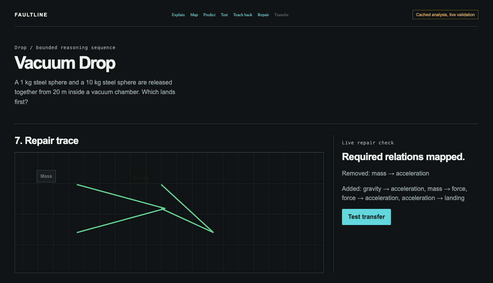

# Faultline

**A scientific reasoning instrument for making physics causal thinking inspectable.**

Faultline separates selecting a correct answer from using a valid method. It maps learner language to authored concepts, identifies a supported faulty relation with literal evidence, requires a prediction, runs a local deterministic simulation, verifies teach-back, and checks transfer.

## Scope

Three authored packs: Vacuum Drop, Collision Forces, and Projectile Motion. It is not a chatbot, authentication system, arbitrary-subject tutor, upload tool, or classroom platform.

## Gold path

Choose scenario → answer → explain → inspect graph and evidence → predict → run simulation → teach back → view repair → transfer → anonymous local report.

## Architecture

`Content packs → bounded analysis → deterministic graph/physics validation → UI`. AI interprets language only; deterministic code owns physics truth, relations, evidence checks, simulation values, repair, and transfer.

## Setup

```bash
npm ci
npm run dev
```

Run `npm run lint`, `npm run typecheck`, `npm run test`, `npm run build`, `npm run test:e2e`, and `npm run evaluate`.

Copy `.env.example` to configure Featherless. Without a key, Faultline visibly uses **Cached analysis, live validation**; simulations and validators remain local. The current evaluation is fixture mode with 30 authored cases (10 per pack) and honestly marks live-model metrics as skipped. Generated production screenshots are in `public/screenshots/`.

## Visual evidence









## Privacy, limits, and attribution

See `docs/PRIVACY.md`, `docs/LIMITATIONS.md`, `docs/EVALUATION.md`, and `docs/IMPLEMENTATION.md`. Physics citations are attached to each pack (OpenStax University Physics Vol. 1). Code is MIT; authored content is CC BY 4.0.
